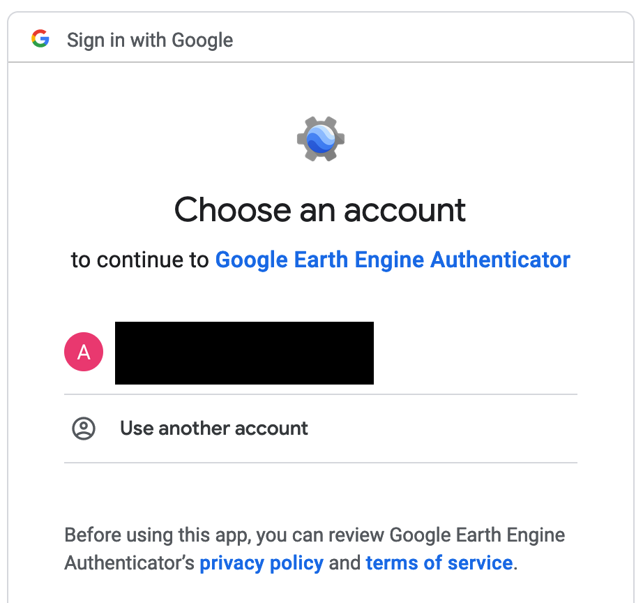
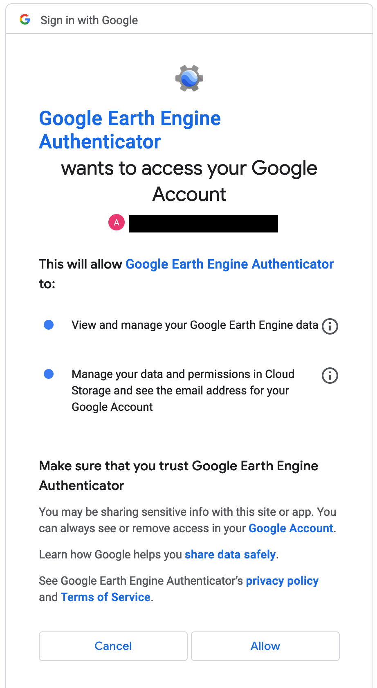
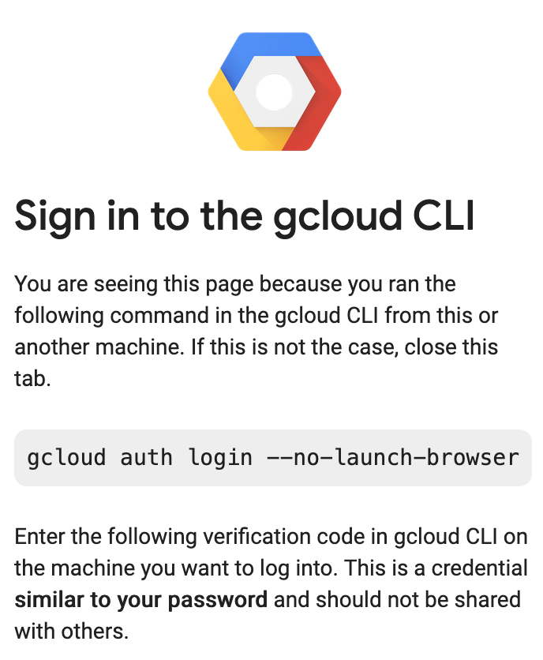

[](https://mybinder.org/v2/gh/urbangrammarai/gee_pipeline/master?labpath=notebooks)


# Google Earth Engine Pipeline

This repository is a pipeline for retrieving imagery from Google Earth Engine for the [Urban Grammar](https://urbangrammarai.xyz/) project.

The purpose is to obtain a time-series (ideally at least yearly) of cloud-free composite images for the UK, for use to infer spatial signatures.

The repo is a fork of [monitoring-ecosystem-resilience](https://github.com/alan-turing-institute/monitoring-ecosystem-resilience) because of the functional similarity, despite the differences in purpose.

The code in this repository is intended to perform three inter-related tasks:

* Download and process satellite imagery from Google Earth Engine.
* Generate cloud-free composite images from Sentinel-2 for each year since 2016.
* Generate "chips" (or patches) suitable for input into the inference model.


### Python

The tasks above are all implemented in Python in the *peep* package. See the [README.md](peep/README.md) in the `peep` subdirectory for details on installation and usage.


## Using the Docker image

There is a Docker image with `peep` and its dependencies preinstalled.

<-- Insert docker pull cmd here -->

```
docker run -d peep
```

### Authenticating the Google Earth Engine

It is not possible to authenticate the google earth engine client directly from within the docker container. Instead, Google earthengine/gcloud CLI tools, provide a way to transfer your authentication details from another computer to the docker container. For this you require:

* The `peep` docker container
* A "local" computer which has:
  * A browser, from which you are able to log into your Google account
  * [gcloud <-- check version number --> installed](https://cloud.google.com/sdk/docs/install).

Open a shell to the docker container:

```
docker exec -it <container_name or id> /bin/bash
```

Ensure that you have the correct conda environment activated:

```
conda activate peep
```

Start the authentication process:

```
earthengine authenticate --quiet
```

This will output a message that looks similar to the example below:

```
gcloud auth application-default login --remote-bootstrap="https://accounts.google.com/o/oauth2/auth?response_type=code&client_id=XXXXXXXXXXXXXXXXXXXXXXXXXXXXXXXXXXXXXXXXXXXXX.apps.googleusercontent.com&scope=https%3A%2F%2Fwww.googleapis.com%2Fauth%2Fearthengine+https%3A%2F%2Fwww.googleapis.com%2Fauth%2Fdevstorage.full_control+https%3A%2F%2Fwww.googleapis.com%2Fauth%2Faccounts.reauth&state=zzzzzzzzzzzzzzzzzzzzzzzzzzzzzz&access_type=offline&code_challenge=yyyyyyyyyyyyyyyyyyyyyyyyyyyyyyyyyyyyyyyyyyy&code_challenge_method=S256&token_usage=remote"
DO NOT PROCEED UNLESS YOU ARE BOOTSTRAPPING GCLOUD ON A TRUSTED MACHINE WITHOUT A WEB BROWSER AND THE ABOVE COMMAND WAS THE OUTPUT OF `gcloud auth application-default
login --no-browser` FROM THE TRUSTED MACHINE.
```

If it is not already, [install `gclould` on your local computer](https://cloud.google.com/sdk/docs/install). Once installed, on your local computer, run the command :

```
gcloud auth application-default login --remote-bootstrap="https://accounts.google.com/o/oauth2/auth?response_type=code&client_id=XXXXXXXXXXXXXXXXXXXXXXXXXXXXXXXXXXXXXXXXXXXXX.apps.googleusercontent.com&scope=https%3A%2F%2Fwww.googleapis.com%2Fauth%2Fearthengine+https%3A%2F%2Fwww.googleapis.com%2Fauth%2Fdevstorage.full_control+https%3A%2F%2Fwww.googleapis.com%2Fauth%2Faccounts.reauth&state=zzzzzzzzzzzzzzzzzzzzzzzzzzzzzz&access_type=offline&code_challenge=yyyyyyyyyyyyyyyyyyyyyyyyyyyyyyyyyyyyyyyyyyy&code_challenge_method=S256&token_usage=remote"
```

This will launch your browser, where you will either need to login to a Google account or select one that you have already logged into:



Next authorise Google Earth Engine to access your Google Account:



Next you should see confirmation that you are successfully logged in:



Below the image you should see a long ramdom-looking string, which you copy and paste back to the docker container (NOTE: Treat this string as you would a password as it gives access to your Google account!)


Once you have authenticated your Docker container, you should be able to run this command without any errors (no output indicates success)
```
python -c "import ee; ee.Initialize()"
```

-- END --